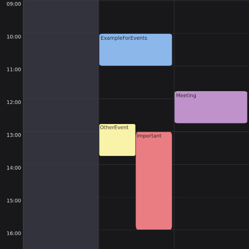

# thunderbird-calendar-theme
## how it works
this css-theme uses the color of any category and displays it as background of the event-feld



## install

first you need to find out what the name of your profile folder is
therefore 
1. open thunderbird
2. go to thunderbird menu
3. click on tools
4. click on export
5. click on open folder
6. then your_profile should be the foldername, something like ****.default, this is the name you need

### Thunderbird installed over Packagemanagers like pacman, dnf, apt … 
```bash
mkdir -p ~/.thunderbird/<your_profile>/chrome
curl -L https://raw.githubusercontent.com/Nyaro01/thunderbird-calendar-theme/main/userChrome.css -o ~/.thunderbird/<your_profile>/chrome/userChrome.css
```
in the codeblock above replace <your_profile> with the name of your profile folder of thunderbird 

### For Thunderbird installed over Flatpack
```bash
mkdir ~/.var/app/org.mozilla.Thunderbird/.thunderbird/<your_profile>/chrome
curl -L https://raw.githubusercontent.com/Nyaro01/thunderbird-calendar-theme/main/userChrome.css -o ~/.var/app/org.mozilla.Thunderbird/.thunderbird/<your_profile>/chrome/userChrome.css
```
in the codeblock above replace <your_profile> with the name of your profile folder of thunderbird 
